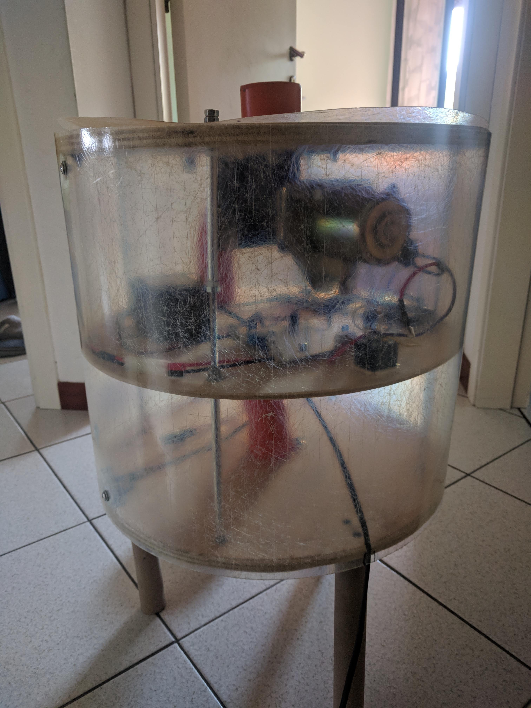
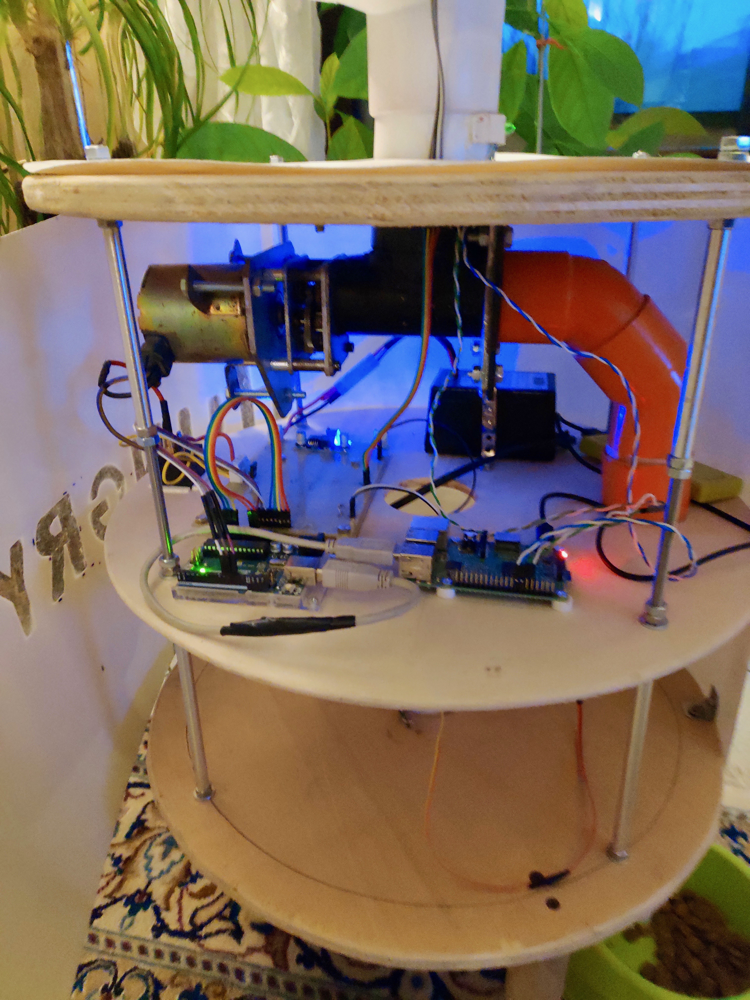

# HungryPet

Pet feeder station created with Arduino and Raspberry PI. With the Android application it is possible to program schedules and control the level of food.

## Description
 
The code is devided in 3 main folders for 3 devices: Android, Raspberry-pi and Arduino.
The first is the Android application developed in java that permits to manage your schedules from your phone. 
The second is used from your Raspberry-pi device developed in Python which is the core that dialog with the database, phone and arduino.
The third is used from your Arduino that is connected with the Raspberry-pi and permits to manage the phisic control.

